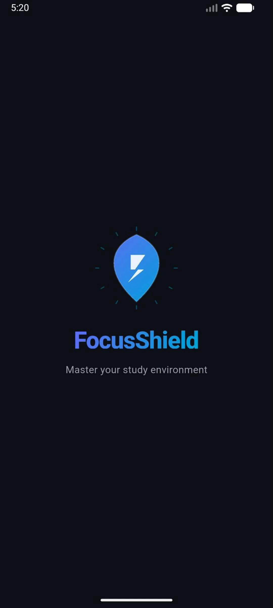
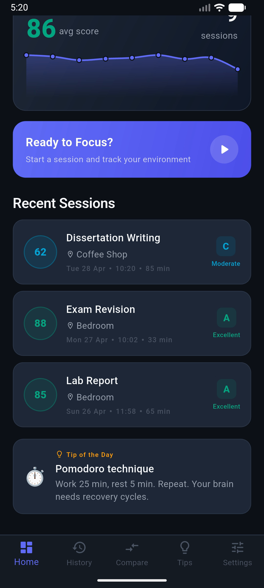
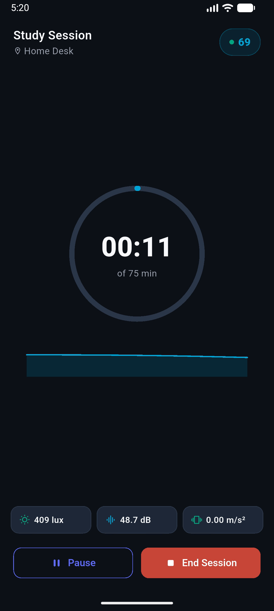
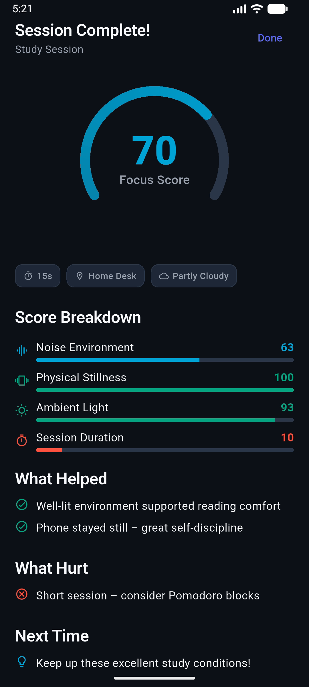
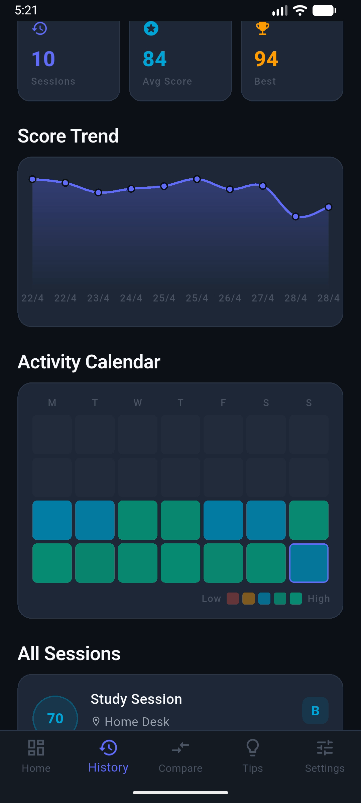
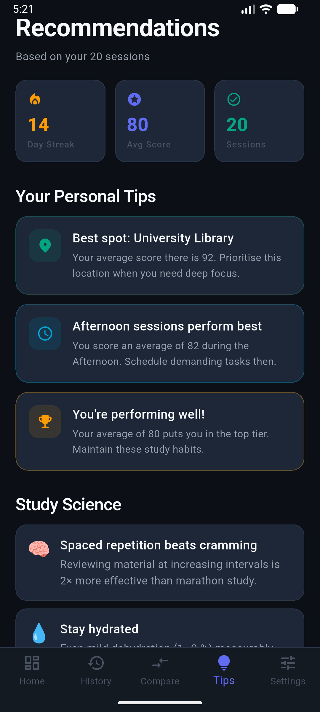

# FocusShield

> **CASA Connected Environment — Mobile App Assessment**  
> A Flutter application that helps students discover and improve the quality of their study environment by combining on-device sensor data with external contextual information.

---

## Project Rationale

Modern students often know **when** they study, but not **how their environment affects** their concentration. FocusShield makes the invisible visible by transforming raw environmental signals into understandable feedback about study quality.

The project fits the **Connected Environment** theme by using the smartphone as a sensing node. The app captures local environmental conditions, combines them with contextual weather data, and turns them into actionable insights that help users identify better study environments over time.

---

## Problem Statement

Students often struggle to understand why some study sessions feel productive while others do not. Environmental conditions such as **noise, lighting, movement, and surrounding context** can significantly influence concentration, but these factors are usually unnoticed or unmeasured.

FocusShield addresses this problem by:

- monitoring environmental signals during study sessions
- logging session data over time
- generating a composite focus score
- comparing historical patterns across sessions and locations
- providing personalised recommendations for improving study conditions

---

## Key Features

- **Multiple connected screens** forming a clear narrative flow
- **Real-time study session monitoring**
- **On-device sensing** using the accelerometer
- **Environmental scoring** based on multiple conditions
- **Session history and analytics**
- **Location and environment comparison**
- **Personalised recommendations**
- **Weather API integration**
- **Demo mode with seeded data** for reliable assessment and presentation

---

## App Screenshots

| Splash | Dashboard | Live Session |
|---|---|---|
|  |  |  |

| End Report | Analytics | Recommendations |
|---|---|---|
|  |  |  |

---

## Demo Video / GIF

- Demo video: [FocusShield Demo](demo/CASA0015%20Vedio.mp4)
- Landing page: [FocusShield Landing Page](https://yuyongbo141-rgb.github.io/casa0015/)

---

## Assessment Alignment

| Criterion | Implementation |
|---|---|
| **Multiple views with clear narrative** | 10 screens forming a coherent study-tracking story |
| **Onboard sensors** | `sensors_plus` accelerometer (real data); ambient light and noise simulated with fallback logic |
| **Logs data over time** | `SharedPreferences` JSON persistence; session history with time-stamped readings |
| **External API / service** | OpenWeatherMap weather integration with configurable API key and deterministic mock fallback |
| **Designed for repeated engagement** | Trend charts, historical views, environment comparison, and personalised recommendations |
| **Strong UI/UX** | Animated score gauge, live sensor cards, charts, transitions, and clear navigation |
| **Splash screen** | Custom animated splash experience |
| **Permissions** | Onboarding permission explanation and runtime handling via `permission_handler` |
| **Clean architecture** | Models / Services / Providers / Widgets / Screens separation |
| **Seeded demo data** | 14 days of generated sessions to support instant demonstration and populated analytics |

---

## Architecture

```text
lib/
├── main.dart
├── app.dart
├── theme/
│   └── app_theme.dart
├── models/
│   ├── session_model.dart
│   ├── sensor_reading.dart
│   └── focus_score.dart
├── services/
│   ├── sensor_service.dart
│   ├── scoring_engine.dart
│   ├── storage_service.dart
│   ├── weather_service.dart
│   └── demo_data.dart
├── providers/
│   ├── session_provider.dart
│   └── settings_provider.dart
├── widgets/
│   ├── score_gauge.dart
│   ├── sensor_card.dart
│   ├── session_card.dart
│   └── focus_chart.dart
└── screens/
```

---

## Focus Quality Score

FocusShield computes a weighted composite score from four sub-scores, each scaled from 0–100:

| Component | Weight | Signal |
|---|---|---|
| **Noise** | 40% | Average session noise level |
| **Movement** | 25% | Accelerometer deviation from rest |
| **Light** | 20% | Environmental light suitability |
| **Duration** | 15% | Bonus for sustained focus sessions |

The score is translated into understandable feedback so that users can see not just **what happened**, but also **why** the session quality changed.

---

## API / Service Integration

The application uses **OpenWeatherMap** to add contextual environmental information to the study experience.

This service is used to:

- enrich the dashboard with weather context
- strengthen the connected-environment framing
- provide realistic context for interpreting study sessions

The app also includes a deterministic mock fallback so the full experience remains demonstrable even without a live API key.

---

## Getting Started

### Prerequisites

- Flutter SDK >= 3.10
- Android device or emulator
- iOS is also supported

### Run

```bash
flutter pub get
flutter run
```

### Demo Mode

Demo Mode is enabled by default for first launch. It generates seeded historical study sessions so that charts and recommendations are populated immediately for assessment and presentation.

---

## Dependencies

| Package | Purpose |
|---|---|
| `provider` | Lightweight state management |
| `sensors_plus` | Accelerometer stream |
| `permission_handler` | Runtime permissions |
| `shared_preferences` | Local session persistence |
| `fl_chart` | Line, bar, and sparkline charts |
| `http` | Weather API calls |
| `intl` | Date / number formatting |

---

## Future Improvements

- real microphone noise capture
- local notifications for study reminders
- room occupancy or campus space API integration
- cloud sync across devices
- on-device ML prediction for ideal study conditions
